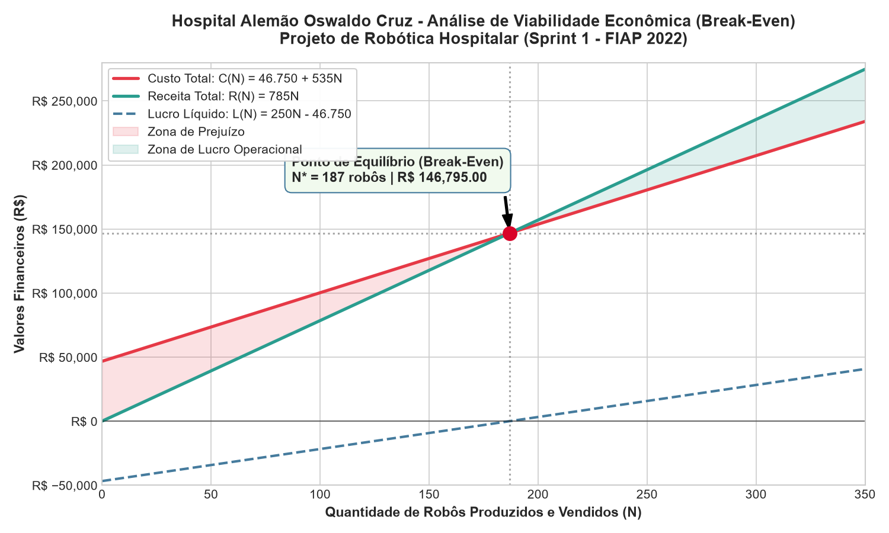

# 🏥 Projeto de Robótica Hospitalar - Hospital Alemão Oswaldo Cruz (HAOC)
## Sprint 1: Modelagem Econômica, Break-Even & Otimização de Produção

Este projeto integra o desafio real da graduação em Engenharia de Computação da FIAP (1º Ano - 2022).

### 📐 Resumo Técnico
- **Modelo de Custo Total**: $C(N) = 46.750 + 535N$
- **Modelo de Receita Total**: $R(N) = 785N$
- **Modelo de Lucro Líquido**: $L(N) = 250N - 46.750$
- **Ponto de Equilíbrio (Break-Even Point)**: $N^* = 187$ unidades ($R\$ 146.795,00$)

### 📊 Gráfico Analítico de Viabilidade

### 💻 Como Executar
O código está totalmente documentado e resolvido passo a passo no caderno [Sprint1_RDP_HAOC_BreakEven_Analysis.ipynb](Sprint1_RDP_HAOC_BreakEven_Analysis.ipynb).
